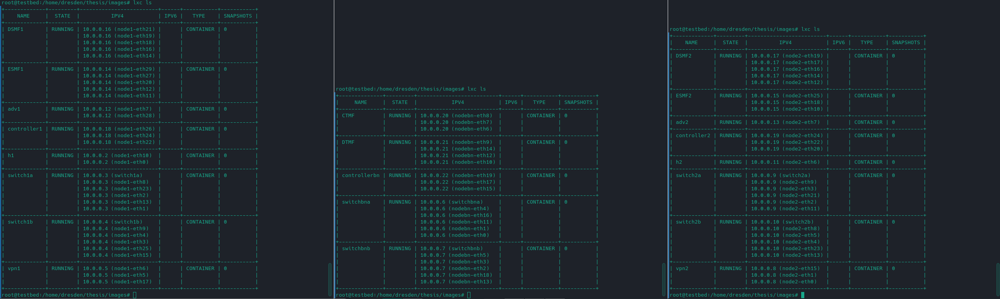

# Remote Edgeslicing scenario

Uses the topology from the [local edgeslicing scenario](../local_edgeslicing/README.md), but deploys
to three compute nodes instead. The compute nodes are connected via a switch.
Each of the three domains are deployed to one compute node each.
The attack scenarios are the same as in the local scenario.

```
   +---- Aruba 2930F ----+
   |          |          |
 node1      nodebn     node2 
```

### Distribution of components



### Used adversary commands

```bash
# Assumption: Using our testbed script
IP adv1 = 10.0.0.12
IP adv2 = 10.0.0.13
# Create queue for egress and note the queue id (on both switches connected to adversary)
$switch1a> curl -X 'PUT' \
  'http://localhost:8082/v1/queue?auth=token' \
  -H 'accept: application/json' \
  -H 'Content-Type: application/json' \
  -d '{
  "queue_id": 0,
  "min_rate": 300000000,
  "max_rate": 300000000,
  "burst_rate": 375000,
  "priority": 55555,
  "port": "node1-eth2"
}' -v
$switch2b> curl -X 'PUT' \
  'http://localhost:8082/v1/queue?auth=token' \
  -H 'accept: application/json' \
  -H 'Content-Type: application/json' \
  -d '{
  "queue_id": 0,
  "min_rate": 300000000,
  "max_rate": 300000000,
  "burst_rate": 375000,
  "priority": 55555,
  "port": "node2-eth4"
}' -v
# Create flows through the network (we only add a queue on the first and last egress for simplicity)
$switch1a> ovs-ofctl add-flow switch1a ip,nw_src=10.0.0.12,nw_dst=10.0.0.13,in_port="node1-eth8",actions=set_queue:<slice_queue_id>,output:"node1-eth2"
$switch1a> ovs-ofctl add-flow switch1a ip,nw_src=10.0.0.13,nw_dst=10.0.0.12,in_port="node1-eth2",actions=output:"node1-eth8"
$switch1b> ovs-ofctl add-flow switch1b ip,nw_src=10.0.0.12,nw_dst=10.0.0.13,in_port="node1-eth3",actions=output:"node1-eth9"
$switch1b> ovs-ofctl add-flow switch1b ip,nw_src=10.0.0.13,nw_dst=10.0.0.12,in_port="node1-eth9",actions=output:"node1-eth3"
$switchbna> ovs-ofctl add-flow switchbna ip,nw_src=10.0.0.12,nw_dst=10.0.0.13,in_port="nodebn-eth4",actions=output:"nodebn-eth1"
$switchbna> ovs-ofctl add-flow switchbna ip,nw_src=10.0.0.13,nw_dst=10.0.0.12,in_port="nodebn-eth1",actions=output:"nodebn-eth4"
$switchbnb> ovs-ofctl add-flow switchbnb ip,nw_src=10.0.0.12,nw_dst=10.0.0.13,in_port="nodebn-eth2",actions=output:"nodebn-eth5"
$switchbnb> ovs-ofctl add-flow switchbnb ip,nw_src=10.0.0.13,nw_dst=10.0.0.12,in_port="nodebn-eth5",actions=output:"nodebn-eth2"
$switch2a> ovs-ofctl add-flow switch2a ip,nw_src=10.0.0.12,nw_dst=10.0.0.13,in_port="node2-eth9",actions=output:"node2-eth3"
$switch2a> ovs-ofctl add-flow switch2a ip,nw_src=10.0.0.13,nw_dst=10.0.0.12,in_port="node2-eth3",actions=output:"node2-eth9"
$switch2b> ovs-ofctl add-flow switch2b ip,nw_src=10.0.0.12,nw_dst=10.0.0.13,in_port="node2-eth4",actions=output:"node2-eth8"
$switch2b> ovs-ofctl add-flow switch2b ip,nw_src=10.0.0.13,nw_dst=10.0.0.12,in_port="node2-eth8",actions=set_queue:<slice_queue_id>,output:"node2-eth4"
# Activate icmp for h1 and h2
$switch1a> ovs-ofctl add-flow switch1a icmp,in_port="node1-eth1",actions=set_queue:<slice_queue_id>,output:"node1-eth2"
$switch1a> ovs-ofctl add-flow switch1a icmp,in_port="node1-eth2",actions=output:"node1-eth1"
$switch1b> ovs-ofctl add-flow switch1b icmp,in_port="node1-eth3",actions=output:"node1-eth9"
$switch1b> ovs-ofctl add-flow switch1b icmp,in_port="node1-eth9",actions=output:"node1-eth3"
$switchbna> ovs-ofctl add-flow switchbna icmp,in_port="nodebn-eth4",actions=output:"nodebn-eth1"
$switchbna> ovs-ofctl add-flow switchbna icmp,in_port="nodebn-eth1",actions=output:"nodebn-eth4"
$switchbnb> ovs-ofctl add-flow switchbnb icmp,in_port="nodebn-eth2",actions=output:"nodebn-eth5"
$switchbnb> ovs-ofctl add-flow switchbnb icmp,in_port="nodebn-eth5",actions=output:"nodebn-eth2"
$switch2a> ovs-ofctl add-flow switch2a icmp,in_port="node2-eth9",actions=output:"node2-eth3"
$switch2a> ovs-ofctl add-flow switch2a icmp,in_port="node2-eth3",actions=output:"node2-eth9"
$switch2b> ovs-ofctl add-flow switch2b icmp,in_port="node2-eth4",actions=output:"node2-eth5"
$switch2b> ovs-ofctl add-flow switch2b icmp,in_port="node2-eth5",actions=set_queue:<slice_queue_id>,output:"node2-eth4"
# Test reachability
$adv1> hping3 --flood --udp -p 5432 10.0.0.13 -d 1200000
$adv2> ifstat
# To remove all flows again
$switch1a> ovs-ofctl del-flows switch1a cookie=0/-1
$switch1b> ovs-ofctl del-flows switch1b cookie=0/-1
$switchbna> ovs-ofctl del-flows switchbna cookie=0/-1
$switchbnb> ovs-ofctl del-flows switchbnb cookie=0/-1
$switch2a> ovs-ofctl del-flows switch2a cookie=0/-1
$switch2b> ovs-ofctl del-flows switch2b cookie=0/-1
```
Hping3 will send about 1.2Gbit/s over a 10Gbit/s link and leave the first switch with ~300Mbit/s 
(due to our bypass configuration of allowing 300Mbit/s per switch of other traffic).
Due to CPU limitation more than 1.2Gbit/s are not possible per adversary.
Even when allocating 3 threads of our CPU resources (4 threads) to multiple adversaries connected similar to adv1,
we can not achieve an increase in loss rate or latency, nor a decrease in bandwidth. More on this below.

### Used slice commands (for initial iperf test)
```bash
# To create
$ESMF1> curl -X 'PUT' \
  'http://localhost:8080/v1/slice?auth=token' \
  -H 'accept: application/json' \
  -H 'Content-Type: application/json' \
  -d '[
{      
  "slice_id": 0,
  "min_rate": 8388608,
  "max_rate": 12000000,
  "burst_rate": 120000000,
  "latency": 3,    
  "tunnel_id": 0,
  "transport_protocol": "UDP",
  "fr": {
    "ip": "10.0.0.2",
    "port": 0,  
    "name": "h1",
    "network": "net1"
  },     
  "to": {       
    "ip": "10.0.0.11",
    "port": 8888,
    "name": "h2",
    "network": "net2"
  }
},
{      
  "slice_id": 0,
  "min_rate": 8388608,
  "max_rate": 12000000,
  "burst_rate": 120000000,
  "latency": 3,    
  "tunnel_id": 0,
  "transport_protocol": "UDP",
  "fr": {
    "ip": "10.0.0.11",
    "port": 8888,
    "name": "h2",
    "network": "net2"
  },     
  "to": {       
    "ip": "10.0.0.2",
    "port": 0,  
    "name": "h1",
    "network": "net1"
  }
}
]' -v

# To delete
$ESMF1> -- curl -X 'DELETE' \
  'http://localhost:8080/v1/slice?auth=token&slice_ids=1000&slice_ids=1001' \
  -H 'accept: */*' -v
```

### Observation

#### Raw output from iperf3
When sending 8M of UDP packets from h1 to h2 via iperf3 (under attack), we get an output similar to this:

```
$> iperf3 -c 10.0.0.11 --udp --port 8888 -b 8M -t 10
[ ID] Interval           Transfer     Bitrate         Jitter    Lost/Total Datagrams
[  5]   0.00-1.00   sec   936 KBytes  7.67 Mbits/sec  0.074 ms  0/768 (0%)  
[  5]   1.00-2.00   sec   976 KBytes  8.00 Mbits/sec  0.097 ms  0/801 (0%)  
[  5]   2.00-3.00   sec   977 KBytes  8.01 Mbits/sec  0.075 ms  0/802 (0%)  
[  5]   3.00-4.00   sec   976 KBytes  8.00 Mbits/sec  0.068 ms  0/801 (0%)  
[  5]   4.00-5.00   sec   976 KBytes  8.00 Mbits/sec  0.091 ms  0/801 (0%)  
[  5]   5.00-6.00   sec   977 KBytes  8.01 Mbits/sec  0.100 ms  0/802 (0%)  
[  5]   6.00-7.00   sec   976 KBytes  8.00 Mbits/sec  0.080 ms  0/801 (0%)  
[  5]   7.00-8.00   sec   976 KBytes  8.00 Mbits/sec  0.084 ms  0/801 (0%)  
[  5]   8.00-9.00   sec   976 KBytes  8.00 Mbits/sec  0.101 ms  0/801 (0%)  
[  5]   9.00-10.00  sec   977 KBytes  8.01 Mbits/sec  0.066 ms  0/802 (0%)  
[  5]  10.00-10.04  sec  40.2 KBytes  7.87 Mbits/sec  0.088 ms  0/33 (0%)  
- - - - - - - - - - - - - - - - - - - - - - - - -
[ ID] Interval           Transfer     Bitrate         Jitter    Lost/Total Datagrams
[  5]   0.00-10.04  sec  9.54 MBytes  7.97 Mbits/sec  0.088 ms  0/8013 (0%)  receiver
```
We performed the same tests as with the local slicing before. The results were the same.
This time we allocated a maximum of 3 threads (out of 4) to traffic generation, reaching speeds of ~4.5GBit/s.
The difference in speeds can be explained by the reduced computational resources.

#### Raw output from ping

Not under attack:
```
$h1> ping 10.0.0.11
PING 10.0.0.11 (10.0.0.11) 56(84) bytes of data.
64 bytes from 10.0.0.11: icmp_seq=1 ttl=64 time=0.807 ms
64 bytes from 10.0.0.11: icmp_seq=2 ttl=64 time=0.672 ms
64 bytes from 10.0.0.11: icmp_seq=3 ttl=64 time=0.679 ms
64 bytes from 10.0.0.11: icmp_seq=4 ttl=64 time=0.676 ms
64 bytes from 10.0.0.11: icmp_seq=5 ttl=64 time=0.688 ms
64 bytes from 10.0.0.11: icmp_seq=6 ttl=64 time=0.699 ms
64 bytes from 10.0.0.11: icmp_seq=7 ttl=64 time=0.693 ms
64 bytes from 10.0.0.11: icmp_seq=8 ttl=64 time=0.692 ms
64 bytes from 10.0.0.11: icmp_seq=9 ttl=64 time=0.680 ms
64 bytes from 10.0.0.11: icmp_seq=10 ttl=64 time=0.685 ms
--- 10.0.0.11 ping statistics ---
10 packets transmitted, 10 received, 0% packet loss, time 9209ms
rtt min/avg/max/mdev = 0.672/0.697/0.807/0.037 ms
```

Under attack:
```
$h1> ping 10.0.0.11
PING 10.0.0.11 (10.0.0.11) 56(84) bytes of data.
64 bytes from 10.0.0.11: icmp_seq=1 ttl=64 time=0.656 ms
64 bytes from 10.0.0.11: icmp_seq=2 ttl=64 time=0.748 ms
64 bytes from 10.0.0.11: icmp_seq=3 ttl=64 time=0.771 ms
64 bytes from 10.0.0.11: icmp_seq=4 ttl=64 time=0.590 ms
64 bytes from 10.0.0.11: icmp_seq=5 ttl=64 time=0.683 ms
64 bytes from 10.0.0.11: icmp_seq=6 ttl=64 time=0.606 ms
64 bytes from 10.0.0.11: icmp_seq=7 ttl=64 time=0.745 ms
64 bytes from 10.0.0.11: icmp_seq=8 ttl=64 time=0.704 ms
64 bytes from 10.0.0.11: icmp_seq=9 ttl=64 time=0.702 ms
64 bytes from 10.0.0.11: icmp_seq=10 ttl=64 time=0.603 ms
^C
--- 10.0.0.11 ping statistics ---
10 packets transmitted, 10 received, 0% packet loss, time 9210ms
rtt min/avg/max/mdev = 0.590/0.680/0.771/0.061 ms
```

There seems to be no difference, so our slicing was successful.
Test scenario was the scenario from above with ~4.5Gbit/s of traffic from multiple adversaries.

#### Test suite output

```
$> lxc file push config_h1.json h1/root/
$> lxc file push config_h2.json h2/root/
$h2> python3 -m host_client config_h2.json <IPERF|SOCKPERF|UDP_PING>
$h1> python3 -m host_client config_h1.json <IPERF|SOCKPERF|UDP_PING>
```
The configurations and outputs can be viewed in this directory in json format.
Sadly udp_ping appears to be broken, as it returns bogus results compared to the other suites, even when idling.
If we still have time in the end, we might attempt to repair it.

Furthermore the latency reported from sockperf seems to be invalid as well, because we receive vastly different results
from `ping` within the same scenario, and the jitter in `iperf3` would need to be higher.
We confirmed the bandwidth using `ifstat` as well and are thus confident that the tool (and also udp_ping) measures this accurately.
We will thus take the results from ping.

The packet drops from sockperf also do not match those from iperf, but because sockperf also reports packet drops
in the base example this is hardly a valid result. It seems like out of all our test suites, iperf and ping are
still the most reliable ones.

### Result
Even under heavy load and increased difficulty, the QoS guarantees remain intact and the slice is isolated.

Our REST adversaries had no effect, apart from the HTTP spammer temporarily rendering services unavailable.
This did not affect existing slices though.

### Topology Implementation
Please refer to the `remote_edgeslicing.py` file. The testbed was deployed to a 3 compute nodes and altered to
include more or less attackers, depending on the test being run. An explanation on what was tested can be viewed above.

### Specs
To produce the results above, the following hardware was used. A similar configuration will most likely achieve similar results.
- Switch: `Aruba 2930F`
- CPU specs per node: `Intel(R) Core(TM) i5-7400 CPU @ 3.00GHz (4 Threads)`
- Memory specs per node: `16GiB DIMM DDR4 Synchronous 2400 MHz (0.4 ns), 256KiB L1 cache, 1MiB L2 cache, 6MiB L3 cache`